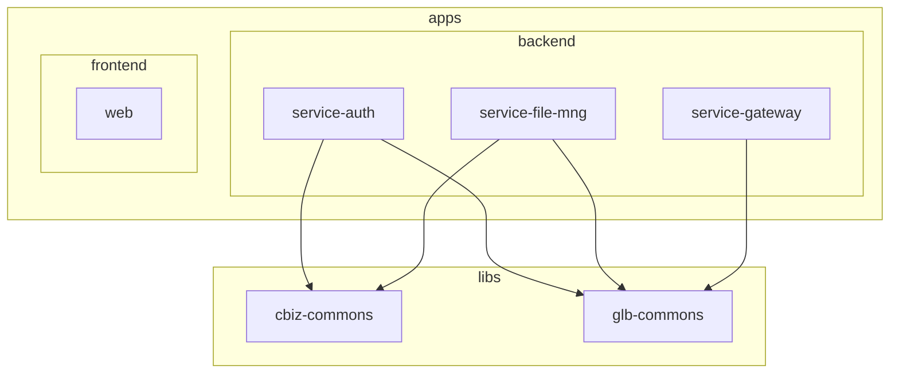

# DrValue BMES

AI를 활용한 퍼스널 컬러 진단 및 옷 가상 피팅 서비스

## 프로젝트 소개

- **AI 퍼스널 컬러 진단**: 사용자 사진/피부톤 분석을 통한 퍼스널 컬러 추천
- **가상 피팅 (Virtual Try-On)**: AI 기반 옷 가상 착용 시연
- 패션·뷰티 도메인에 특화된 개인화 서비스 제공

## 기술 스택

| 구분           | 기술                                           |
| -------------- | ---------------------------------------------- |
| **프론트엔드** | Next.js 14, React 19, TypeScript, Tailwind CSS |
| **백엔드**     | NestJS, TypeORM, Fastify, MySQL                |
| **인프라**     | Redis, RabbitMQ, MinIO, Elasticsearch          |
| **모노레포**   | Nx, pnpm                                       |

## 프로젝트 구조



| 경로                 | 설명                                                                            |
| -------------------- | ------------------------------------------------------------------------------- |
| `apps/backend/`      | 인증(service-auth), 파일관리(service-file-mng), API 게이트웨이(service-gateway) |
| `apps/frontend/web/` | Next.js 웹 앱                                                                   |
| `libs/`              | 공통 모듈 (cbiz-commons, glb-commons)                                           |

## 사전 요구사항

- Node.js 18+
- pnpm
- Python 3.x (선택) – UI/UX Pro Max 스킬용

## 설치 및 실행

### 설치

```bash
pnpm install
```

### 빌드

```bash
pnpm build:frontend   # 프론트엔드
pnpm build:backend    # 백엔드 전체
```

### 개발 서버

```bash
pnpm serve:web        # Next.js → http://localhost:3000
pnpm serve:auth       # 인증 서비스
pnpm serve:gateway    # API 게이트웨이
pnpm serve:file-mng   # 파일 관리 서비스
```

## Nx 명령어

```bash
nx run web:build
nx run service-auth:serve
nx graph    # 의존성 시각화
```

## UI/UX Pro Max 사용법

프로젝트에 설치된 AI 디자인 지원 스킬 (67 스타일, 96 컬러 팔레트, 57 폰트 조합, 99 UX 가이드라인).

**사전 요구사항:** Python 3.x (`python3 --version`)

### 1) 디자인 시스템 생성 (UI 작업 전 권장)

```bash
python3 .cursor/skills/ui-ux-pro-max/scripts/search.py "퍼스널 컬러 진단 패션" --design-system -p "DrValue BMES" -f markdown
```

### 2) 프로젝트에 디자인 시스템 저장 (세션 간 유지)

```bash
python3 .cursor/skills/ui-ux-pro-max/scripts/search.py "퍼스널 컬러 가상 피팅" --design-system --persist -p "DrValue BMES"
```

→ `design-system/MASTER.md` 생성. 페이지별 오버라이드는 `--page "대시보드"` 추가.

### 3) 도메인별 검색 (추가 상세 정보)

| 용도        | 도메인       | 예시                                     |
| ----------- | ------------ | ---------------------------------------- |
| 스타일 옵션 | `style`      | `--domain style "glassmorphism minimal"` |
| 컬러 팔레트 | `color`      | `--domain color "beauty fashion"`        |
| 폰트 조합   | `typography` | `--domain typography "elegant modern"`   |
| UX 가이드   | `ux`         | `--domain ux "accessibility animation"`  |

```bash
python3 .cursor/skills/ui-ux-pro-max/scripts/search.py "beauty fashion" --domain color
```

### 4) 스택별 가이드 (Next.js + Tailwind)

```bash
python3 .cursor/skills/ui-ux-pro-max/scripts/search.py "레이아웃 폼" --stack nextjs
```

### 5) 채팅에서 자연스럽게 요청

- "퍼스널 컬러 진단 대시보드 UI 만들어줘"
- "가상 피팅 선택 화면 디자인해줘"

Cursor가 UI/UX 요청을 인식하면 자동으로 스킬을 활용함.

## 참고

- [Nx 문서](https://nx.dev)
- [Nx 태스크 실행](https://nx.dev/features/run-tasks)
# colorme-capstone
