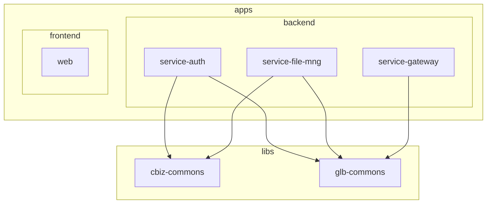

# Capstone Project

AI를 활용한 퍼스널 컬러 진단 및 옷 가상 피팅 서비스

## 프로젝트 소개

- **AI 퍼스널 컬러 진단**: 사용자 사진/피부톤 분석을 통한 퍼스널 컬러 추천
- **가상 피팅 (Virtual Try-On)**: AI 기반 옷 가상 착용 시연
- 패션·뷰티 도메인에 특화된 개인화 서비스 제공

## 기술 스택

| 구분           | 기술                                           |
| -------------- | ---------------------------------------------- |
| **프론트엔드** | Next.js 14, React 19, TypeScript, Tailwind CSS |
| **백엔드**     | NestJS, TypeORM, Fastify, MySQL                |
| **인프라**     | Redis, RabbitMQ, MinIO, Elasticsearch          |
| **모노레포**   | Nx, pnpm                                       |

## 프로젝트 구조



| 경로                 | 설명                                                                            |
| -------------------- | ------------------------------------------------------------------------------- |
| `apps/backend/`      | 인증(service-auth), 파일관리(service-file-mng), API 게이트웨이(service-gateway) |
| `apps/frontend/web/` | Next.js 웹 앱                                                                   |
| `libs/`              | 공통 모듈 (cbiz-commons, glb-commons)                                           |

### 퍼스널 컬러 도메인 엔티티 (glb-commons)

| 엔티티                         | 테이블명                    | 설명                                   |
| ------------------------------ | --------------------------- | -------------------------------------- |
| `RnDefaultPersonalColorEntity` | `rn_default_personal_color` | 퍼스널 컬러 톤 마스터 (Spring Warm 등) |
| `RnDefaultPcUserEntity`        | `rn_default_pc_user`        | 퍼스널 컬러 앱 사용자                  |
| `RnDefaultPcAnalysisEntity`    | `rn_default_pc_analysis`    | 퍼스널 컬러 진단 결과                  |
| `RnDefaultPcSavedLookEntity`   | `rn_default_pc_saved_look`  | 가상 피팅 저장 결과                    |

## 사전 요구사항

- Node.js 18+
- pnpm

> Python은 별도 설치할 필요 없음. UI 작업 시 Cursor 채팅에서 자연어로 요청하면 AI가 디자인 스킬을 활용함.  
> 스크립트로 디자인 시스템을 생성하려면 Python 3.x 선택 설치.

## 설치 및 실행

### 설치

```bash
pnpm install
```

### 빌드

```bash
pnpm build:frontend   # 프론트엔드
pnpm build:backend    # 백엔드 전체
```

### 개발 서버

```bash
pnpm serve:web        # Next.js → http://localhost:3000
pnpm serve:auth       # 인증 서비스
pnpm serve:gateway    # API 게이트웨이
pnpm serve:file-mng   # 파일 관리 서비스
```

## Nx 명령어

```bash
nx run web:build
nx run service-auth:serve
nx graph    # 의존성 시각화
```

## UI/UX Pro Max 사용법

프로젝트에 설치된 AI 디자인 지원 스킬 (67 스타일, 96 컬러 팔레트, 57 폰트 조합, 99 UX 가이드라인).

### 채팅으로 바로 요청 (권장)

Python 설치 없이 Cursor 채팅에서 자연어로 요청하면 됨. AI가 스킬을 자동 활용함.

- "퍼스널 컬러 진단 대시보드 UI 만들어줘"
- "가상 피팅 선택 화면 디자인해줘"

## 참고

- [Nx 문서](https://nx.dev)
- [Nx 태스크 실행](https://nx.dev/features/run-tasks)
